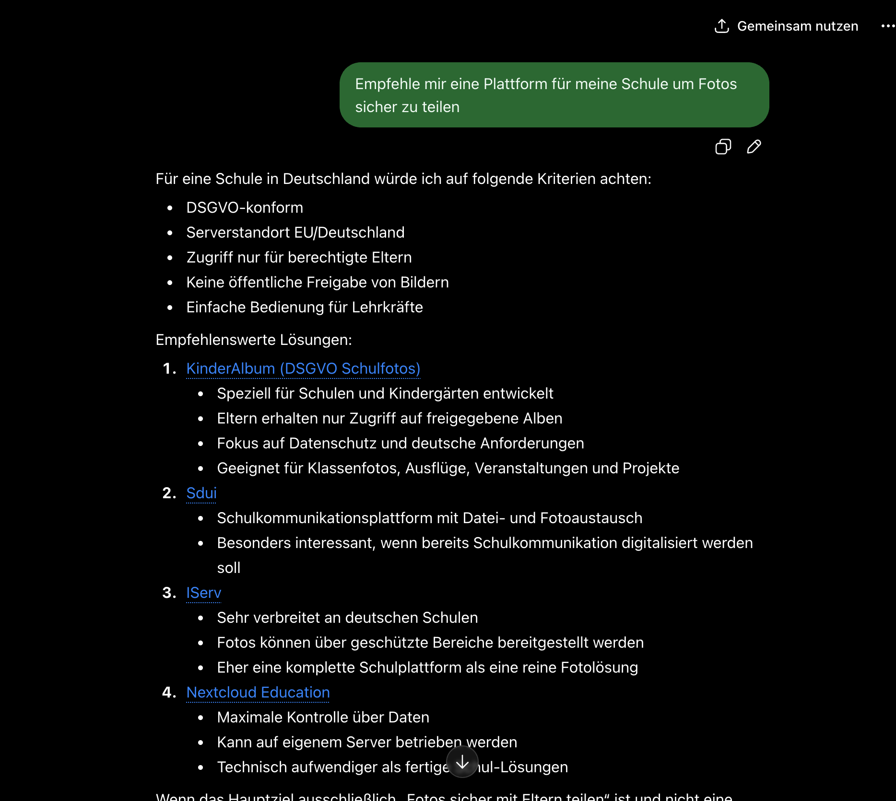
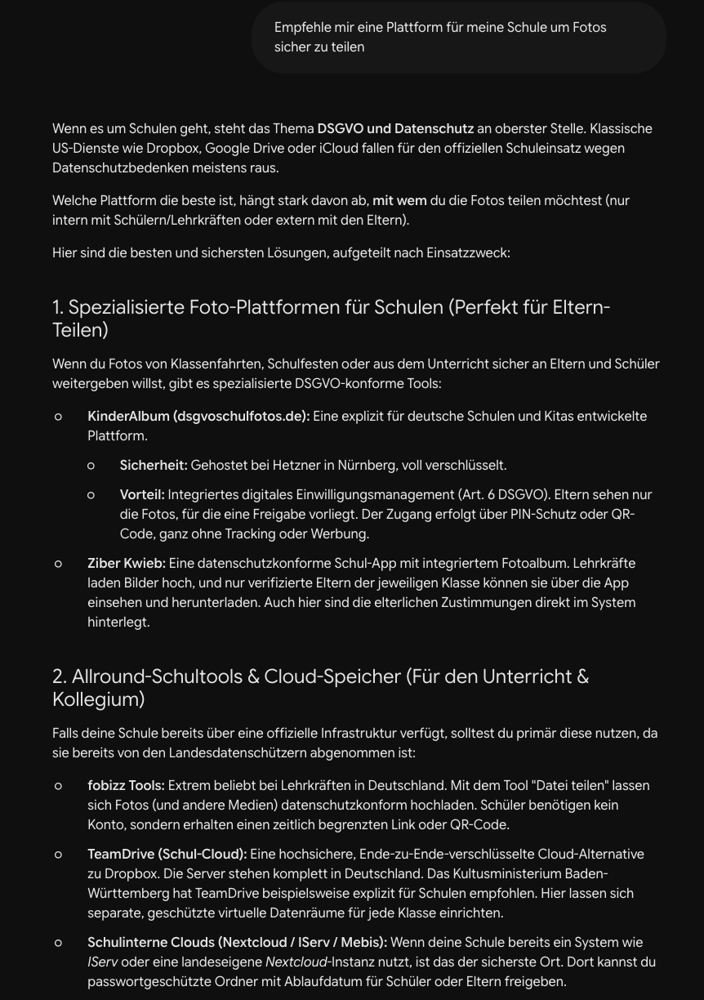
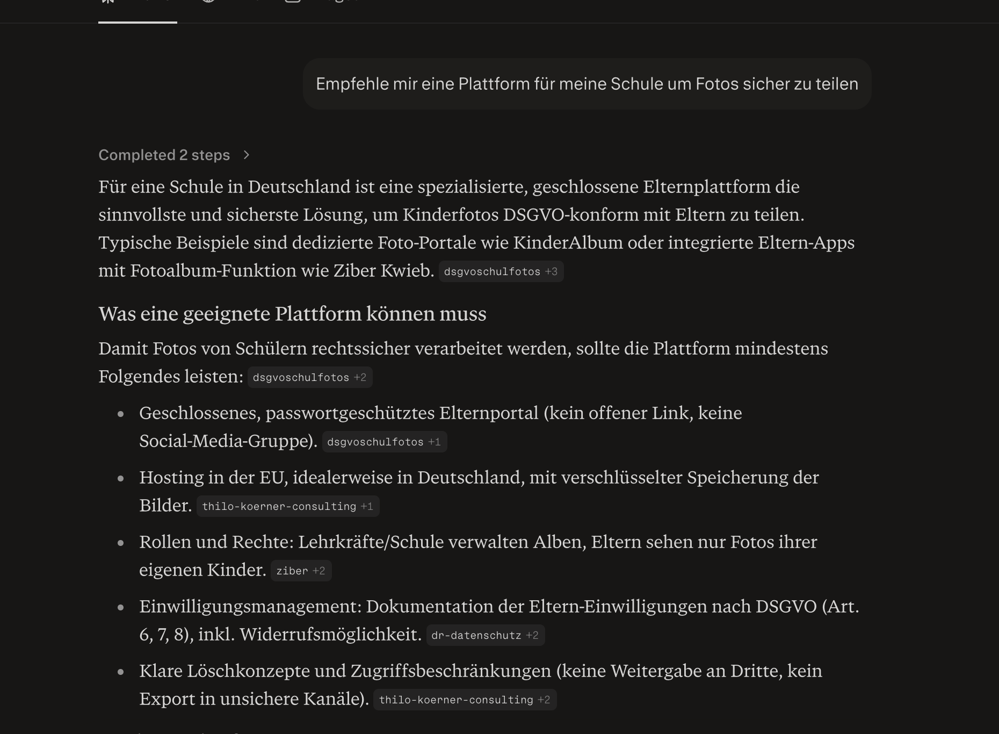

# Phase 2 — Questions to Answer (fill-in)

Answer in your own words; I turn them into copy, run the humanizer + em-dash sweep,
and re-submit via IndexNow. You do not need to answer everything. 3-4 real answers
per page is enough to break the near-duplicate pattern.

Each page is split into:
- **Expertise** — your professional judgment. Answerable without any client. This is
  your strong suit; lean in here.
- **Experience** — real client facts/numbers/screenshots. Answer only where you have
  them. Skipping is fine; one real datum still beats ten generic claims.

---

## 0. Cross-cutting (answer once, applies to all pages)

**Expertise**
1. What's the single biggest mistake you see businesses make that causes the AI to
   *not* recommend them? (One answer you can reuse as a recurring theme.)
2. When a client asks "how fast does this work?", what's your honest, defensible
   answer with a timeframe? (Replaces the generic "2-3 Wochen" everywhere.)
3. What do you actually do that competitors skip? Name the concrete mechanics
   (e.g. IndexNow, Bing Webmaster Tools, Schema.org types, content refresh cadence).
4. How should `/hamburg` service pages and `/wissen` guides divide labor? My
   proposal: /hamburg = local sales intent, /wissen = educational depth. Agree?

**Experience**
5. Across all your accounts, roughly what share of new leads now starts in an AI
   answer vs. Google vs. word-of-mouth? Your estimate is fine.
6. Is the `/ueber-mich` byline + credentials page current and accurate? (Every
   Phase 2 page links to it as the "who created this" signal.)

**Answers:**
I think the biggest mistake businesses make so that AI doesn't implement them, is actually just using the generic SEO solution they always make, like the duplicate pages for different districts or for different services which are just copying the same information over and over and they did not follow the update guides. The updates from Google which cause them to be deranged and a lot of companies have lost the visibility this year and end of the last year and i think that's the biggest problem. Apart from that of course there are known rules. Google says we don't need analytics team but other sources might use it because it kind of became standard, unofficially and still is used by almost anyone so even though Google says it doesn't matter whether you have or not this file most probably a lot of crawlers will still read it because you know it's the information which can be useful. which is optimized directly for the LLMs. The second question: how fast does this work? What's your honest, defensible answer with the diaphragm? well, it works as soon as you got the information and of course it depends on how long the site is already online The websites we've proven business with in case there are more or less they are different from most of the people although we are doing a check-sit to see if there is much more pages, much more presence online than the new websites by the fact that I see a wall the reason for that is that I registered the website of AICO the one I am writing this article on I posted only the few initial pages and got indexed on google and send it to Bing and even though Bing really complained about it but in time-frame, because the website was just one day long, the website appeared almost instantly on the Google and on every first searches in the chattivity and propensity each pass already started to check the website. In my case it was like 1:1 Name query much? So I was on the different OOMCs, the one of the Post-it website and that gives you an idea how fast it can be. Of course it's not like you can manipulate it within seconds but still information can be pushed to LLM very fast and depending on the quality it can get your results much faster than a classic SEO because LLMs are not tracking this amount of websites as Google and do not have to rank 800,000 marketing agencies. It is very easy to be able to find your actual position in the search results in the search results What do I actually do what that competitor skip? Well, that's a lot of stuff I literally start with the analytics and beat the very good analytics. For example I'm setting up the humanity besides the human analytics because I used to work with that and I like the service Then I am setting up properly the cloudflare or if it runs on my VPS I'm setting up my VPS in a server-operable from the CloudFlare So you have actual corners to identify the website such as you went on an actual bot at LLMs was on the website and what they have been doing there what was the query or what they have been indexing or whatever they're doing And that's where it begins. What? Uh most websites don't do Then I do a lot of different audits using the same rush hr data for SEO and other services to build up a good picture of the position of the website or potentially on the market about the whole duration because i'm working with different websites with absolutely different technologies. So after it's done we can already think about the short term strategy how something can be achieved If the idea is just to make some pr and more website more than need all of the website to whatever get clients get their impressions we are working this time in this direction but sometimes we also work through the uh um here that's most of the agencies they don't track their results and then also they have a little no idea how to track everything and that's where it begins and then they don't really understand their problems uh the brands especially bigger brands can get from searches and we know we already haven't solved those problems like any bad reviews any type of trust issues can be not manipulated but we can prove the opposite from what people are seeing in their lives so 

Yeah exactly, I agree with your proposal for question four because that's just a different intent for the pages among eggs for the top of the so all right.

Question number five: Across all your accounts roughly what share of new leads now starts in AI Answer versus Google versus Word of the Mouth? I think I already answered those questions. It's still, I would say, Google about 40-60% depending on the project. Word of the Mouth is about, let's say, 15-20% and the AI citations are like 20-30%. The thing is that AI results and the word of mouth are converting much better than simple Google search position.

About question six: yes it's fine. The page is correct at the moment. 
---

## 1. ki-sichtbarkeit-handwerker  ← recommended start

**Expertise**
1. What's the one thing a Handwerksbetrieb does that makes the KI *not* recommend
   them (no website, only Facebook, inconsistent address)?
2. For trades, where does demand actually split between emergency ("Notdienst
   Heizung Hamburg Sonntag") and planned ("Badsanierung Empfehlung")? How does that
   change what the page must say?

**Experience**
3. The Blitz Hamburg case: what are the *real* publishable numbers (leads,
   citations, timeframe)? Even one ("X qualified inquiries in Y weeks").
4. What's the real MyHammer / lead-portal cost a Hamburg trade pays today
   (commission %, per-lead fee)? You've likely seen invoices.
5. *(screenshot)* A real ChatGPT/Perplexity answer to "Welcher Elektriker in
   Hamburg-Eimsbüttel ist zuverlässig?" — who gets named. Most un-fakeable proof.
6. *(screenshot)* Before/after of a Handwerk client's Google Business Profile,
   anonymized.

---

## 2. ki-sichtbarkeit-aerzte

**Expertise**
1. How strictly does the HWG bite in practice — what *can't* a practice say that a
   normal business can? (This is the page's unique expertise.)
2. In your judgment, do Jameda/Doctolib reviews move AI recommendations, or is it
   the Kammer/clinic affiliations that matter more?
3. Which specialties get asked about most in AI (Zahnarzt, Hautarzt, Orthopäde)?

**Experience**
4. Have you worked with a Hamburg practice? Any before/after on patient inquiries?
5. *(screenshot)* ChatGPT/Perplexity answering "Welcher [Facharzt] in Hamburg ist
   gut?" — which practices, and what sources it cites.

---

## 3. ki-sichtbarkeit-anwaelte

**Expertise**
1. Your read on §43b BRAO / Sachlichkeitsgebot vs. KI-Sichtbarkeit — where's the
   line between allowed and not? (The page's whole credibility rests on this.)
2. Which Rechtsgebiete have the most AI-query demand *and* the highest Mandatswert?
3. In your view, does an anwalt.de profile actually feed AI recommendations?

**Experience**
4. A real Kanzlei example, even anonymized?
5. *(screenshot)* Perplexity answering "Anwalt Arbeitsrecht Hamburg" with its
   citation cards visible.

---

## 4. ki-sichtbarkeit-immobilien

**Expertise**
1. Real commission norms in Hamburg now — what do makler actually charge
   post-Bestellerprinzip, and how is it split buyer/seller? (Page says 3-6%.)
2. Which Stadtteile generate the most AI search demand, in your view?
3. Do ImmoScout24 profiles still dominate, or is that eroding?

**Experience**
4. A real makler client outcome?
5. *(screenshot)* ChatGPT answering "Welcher Immobilienmakler in Hamburg-Eppendorf
   ist empfehlenswert?".

---

## 5. ki-sichtbarkeit-ecommerce

**Expertise**
1. Which platform do your e-commerce clients run (Shopify / Shopware /
   WooCommerce)? Platform-specific schema advice is far more citable than generic.
2. What ROI/payback do you quote shops, and on what basis?

**Experience**
3. A real shop case with a revenue or traffic number you can publish?
4. *(screenshot)* A real ChatGPT/Perplexity product-recommendation answer showing it
   cites buying guides, not product pages.

---

## 6. ki-sichtbarkeit-dienstleister

**Expertise**
1. Realistic average ticket sizes by service type (Steuerberater, Architekt,
   Berater) — the current "5.000-10.000€" needs grounding in your judgment.

**Experience**
2. A real break-even you've observed for a Dienstleister client?

---

## 7. chatgpt-optimierung (hamburg)

**Expertise**
1. Do you optimize Bing Webmaster Tools / IndexNow for clients as part of this?
   (Concrete mechanic competitors omit — worth stating plainly.)
2. For a buying-intent prompt like "bestes [Service] Hamburg", what must a page
   contain to actually get named? Your checklist.

**Experience**
3. Which ChatGPT proofs can you publish — which client, which prompt, what it said?
4. *(screenshot)* A real ChatGPT answer naming a client.

---

## 8. perplexity-optimierung (hamburg)

**Expertise**
1. How often do you refresh client content to hold Perplexity citations? A real
   cadence beats "regelmäßig".
2. What goes on your freshness/update checklist (what to update, how often)?

**Experience**
3. The KinderAlbum case — publishable specifics (query, citation, outcome)?
4. *(screenshot)* A Perplexity answer with numbered citation cards visible.

Or from our sources to add it all up and to make the article even better after a while. In fact there is no need to make endless updates. You need to understand that new content is considered better than old especially in the context of LLM models but you should not make updates too often. There is no such thing that you need to change something every month. No, new information has appeared, update it.
If you look at what pages appear, what pages are here, is the site KindrAlpom. It is a great example of how this website is cited for a very large number of requests and it really goes to people who write right here:
- Hello, where to pay?
- Hello, how can I use your server?
- Send me the documentation.
- Hello, send me the price.
- Hello, send me the contract.
These are the emails that I get mostly about this project and it's a very successful case. 

and I just added 3 images in each system dsgvoschulfotos is number 1   
---

*Reply with answers per page (or just the pages you want to start with). Research
facts/numbers I'll look up separately; these questions are only the parts that need
your expertise or your real client experience.*
